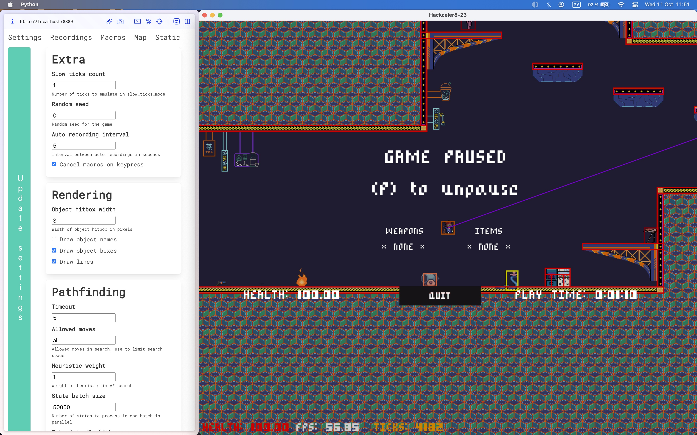
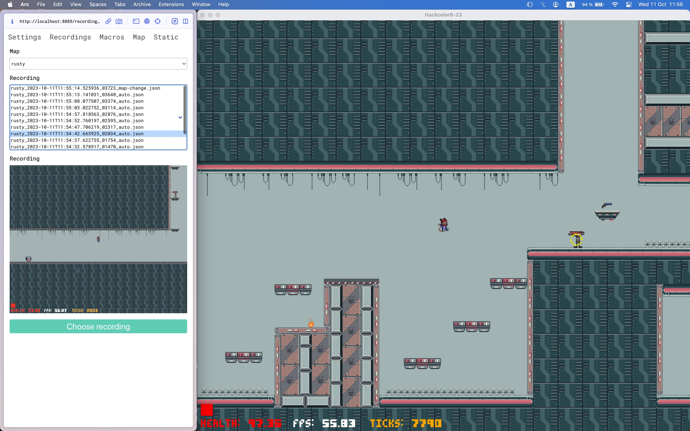
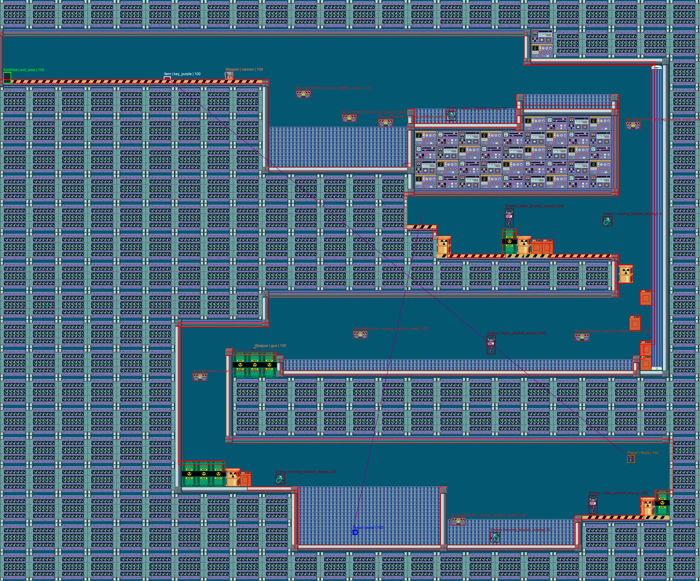

# Hackceler8 2023

Tooling for the Google CTF 2023 Hackceler8 finals by the C4T BuT S4D team.

## Features

- Pathfinding on `Ctrl+LClick` using a parallel A\* ([cheats-rust](cheats-rust)), for which the whole physics engine was rewritten in Rust.
- GUI modifications to include hitbox highlighting, object (keys & other items) tracing, object names and auxilary info (fps, ticks, boss HP).
- Slow-tick mode toggled on `=`, with `Backspace` used to advance a constant (1 by default) number of ticks. Debug info about the player is printed to the console when slow-tick mode is enabled.
- Playthrough recording is toggled on `Ctrl+R`, with saves being taken every 5 seconds by default and additionally on various events (map change, death, manual save). Recording to be played can then be chosen in the cheats UI and enabled on `Ctrl+L`.
- Up to 9 macros (useful for completing various NPC-related challenges) can be added through the cheats UI, and can be replayed manually using `Alt+N`.
- Active map rendering happens in the cheats UI. Additionally, all maps can be prerendered using `&`, the prerenders are placed in the `static` directory of the cheats UI.
- Automatic shooting with smart weapon cycling via dropping the current weapon and instantly picking it up enabled on `]`. Also enables automatic shooting for the Danmaku boss fights.
- Negation of control inversion by enemies on the client's side.
- Utility [client.sh](./game/client.sh) and [server.sh](./game/server.sh) scripts to start the game locally in different modes and with/without SSL.

## Cheats UI

### Settings

Pathfinding parameters, GUI modifications, and other cheats can be configured here.

### Recordings

Recordings are listed for each map with an additional screenshot of the game at the time when the recording was saved.

### Map

An overview of the current map with all the extra GUI modifications rendered.

